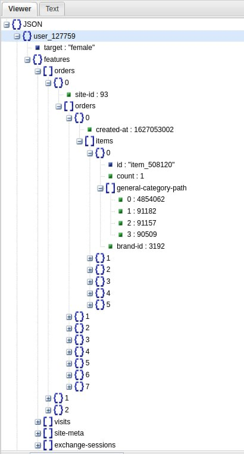

# Hackathon 2023 

>
>
>## Команда «DataHunters»
>
>ШМЕЛЬКОВ Юрий, МАКЕЕВА Анастасия, ОЖЕРЕЛЬЕВ Виктор, КАРАГОДИН Николай, БОГОМОЛОВ Алексей, АЛМАЗОВА Елизавета, МАТЕСОВ Данил.

# Создание модели, предсказывающей пол пользователя (м/ж) на основе данных о его активности.

## Описание датасета

В датасете содержатся данные по визитам сайтов и заказам пользователей, в виде идентификаторов сайтов, идентификаторов категорий товаров, идентификаторов пользователей, времени событий и временных интерваллов сессий, проведенных на сайтах.

Основная идея для цели использования датасета - основываясь на данные о посещаемости сайтов, выбранных товаров, научиться распознавать пол человека по действиям, разработать модель для предсказания.

## Структура датасета

## Методы сбора и обработки данных
Данные предоставлены компанией.

## Описание ноутбуков

Ноутбуки разделены на три части: обработка данных, анализ данных и моделирование.

1. Поэтапная обработка данных.
2. Поэтапный анализ данных.   
3. Моделирование.

Работа велась с помощью среды Jupyter Notebook и технического стека: pandas, Online JSON Viewer, Database tool - Dbeaver, XGBoost, Catboost.

## Структура репозитория

    ├── DataProcessing                          # обработка данных
    ├────── Train_Val_preparing_WithAgg.ipynb          # Предобработка train и val для модели с агрегацией
    ├────── Train_preparing_orders_WithoutAgg.ipynb    # Предобработка train для модели без агрегации
    ├────── Val_preparing_orders_WithoutAgg.ipynb      # Предобработка val для модели без агрегации
    ├────── feature_extract_WithAgg.ipynb              # Извлечение признаков для модели с агрегацией
    ├── Model_WithAgg.ipynb                     # Модель с агрегацией
    ├── Model_WithoutAgg.ipynb                  # Модель без агрегации
    ├── predict_test.parquet                    # Предсказание на test датасете
    ├── FinalPresentation.pdf                   # Презентация решения
    └── README.md                               # документация по проекту
